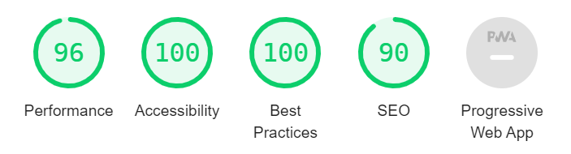

# 🪐 Star Wars Application
---

## 🐶 Available Scripts and Commands

```bash
# Install
npm i                    # install dependencies
```

```bash
# General
npm run start            # run app in the development mode
npm run storybook        # run storybook
npm run deploy           # deploy app on Github Pages
```

```bash
# Deploy (part of "deploy" script)
npm run build            # builds the app for production
npm run build-storybook  # storybook build
npm run build-gh-pages   # deploy on Github Pages
```

```bash
# Not used
npm run eject            # remove the single build dependency
npm run deploy-storybook # storybook deploy
```

---

## 🦄 API
- https://swapi.dev (основное API)
- https://swapi.py4e.com (запасное API - если основное не работает)
- https://starwars-visualguide.com (изображения для API)


---


## 🐗 Lighthouse Metrics Performance


---


